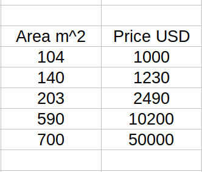

Trong bài này, chúng ta sẽ tìm hiểu về Linear Regression, Logistic Regression, dùng Gradient Descent để tìm tham số cho cả 2 thuật toán, dùng Normal Equation để tìm tham số cho Linear Regression.

## Linear Regression

Giả sử bài toán cần giải là tìm giá nhà dựa trên diện tích căn nhà. Bộ dữ liệu có $m$ dòng, 2 cột, một cột là diện tích căn nhà và một cột là giá của căn nhà.

Để dự đoán giá căn nhà ta sẽ dùng một hàm số tuyến tính $y = ax+b$, trong đó $y$ là giá nhà, $x$ là input, trong trường hợp này là diện tích căn nhà, $a,b$ là tham số học được từ dữ liệu.

Ta sẽ dùng ký hiệu $\theta$ để biểu diễn một vector 